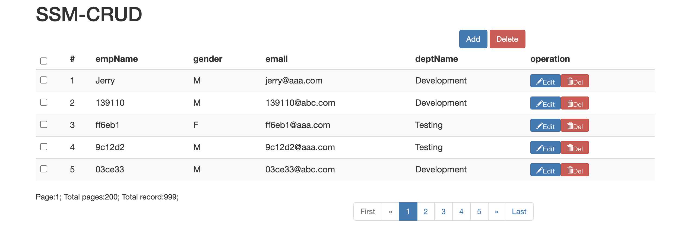
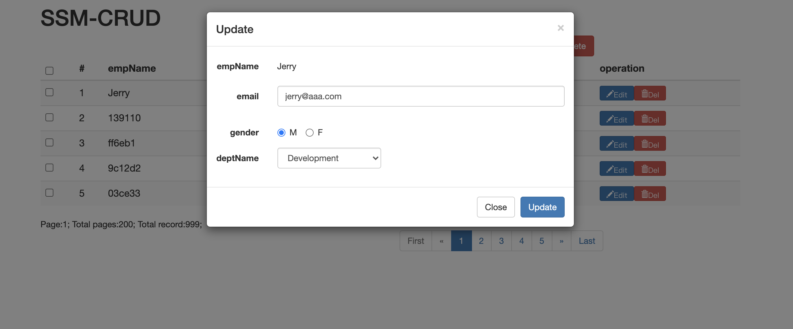

# EmployeeManagementSystem
An employee management system based on spring + springmvc + mybatis; realized a set of basic CRUD functions. 
It involves sending ajax requests, jQuery username validation, UI design, RESTful URI, server-side SSM framwork build and some simple business flows. 

## Main functions

1. Query and display in multiple pages
2. Add employee
    - username & email validation
    - client-side: jQuery; server-side: JSR303
3. Edit employee info
    - prefill employee info
4. Delete employee individually
5. Delete employee in bulk

## Technologies

- Framework: SpringMVC + Spring + Mybatis
- Database: MySQL
- Front-end: BootStrap
- Dependency management: Maven
- Pagination: pagehelper (Mybatis)
- Reverse engineering: MyBatis Generator

